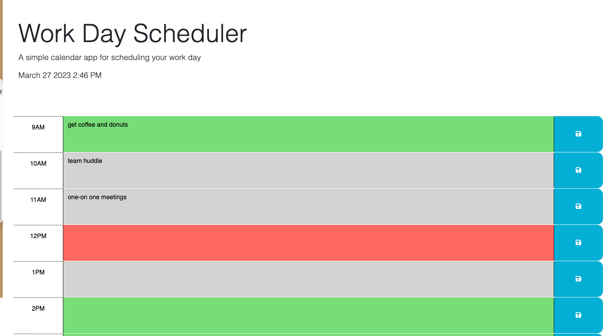

# Work Day Scheduler

## Description

A simple calendar application that allows a user to save events for each hour of the day by modifying starter code. This app will run in the browser and feature dynamically updated HTML and CSS powered by jQuery.


## User Story

```md
AS AN employee with a busy schedule
I WANT to add important events to a daily planner
SO THAT I can manage my time effectively
```

## Acceptance Criteria

```md
GIVEN I am using a daily planner to create a schedule
WHEN I open the planner
THEN the current day is displayed at the top of the calendar
WHEN I scroll down
THEN I am presented with timeblocks for standard business hours
WHEN I view the timeblocks for that day
THEN each timeblock is color coded to indicate whether it is in the past, present, or future
WHEN I click into a timeblock
THEN I can enter an event
WHEN I click the save button for that timeblock
THEN the text for that event is saved in local storage
WHEN I refresh the page
THEN the saved events persist
```

The following animation demonstrates the application functionality:




## Tasks Completed

* wrapped the code in a call to jQuery to ensure the code isn't run until all elements in the html are rendered in the browser
* added a listener for click events on the save button
* added code to compare the time-block to the current hour and apply teh past, present, or future class
* added code to display any user input saved in local storage in the text area elements
* added code to display the current date in the header

## Installation
N/A

## Usage
When the page is loaded, the current day is displayed in the header of the calender. Time blocks for 9AM to 5PM are displayed on the page, color-coded to indivate whether the time block is in the past (gray), present (red), or future (green). User can add events to each time block and save them to local storage. When the page is refreshed, the saved events are displayed on the page.

Link to deployed website - https://jomaduagwu.github.io/work-day-scheduler/

## Credits
Starter code was cloned from Georgeyoo https://github.com/coding-boot-camp/crispy-octo-meme.git

## License
Please refer to the LICENSE in the repo.

## Badges
N/A

## Features
* Bootstrap 
* Google Fonts
* Font Awesome
* jQuery
* day.js

## Tests
N/A